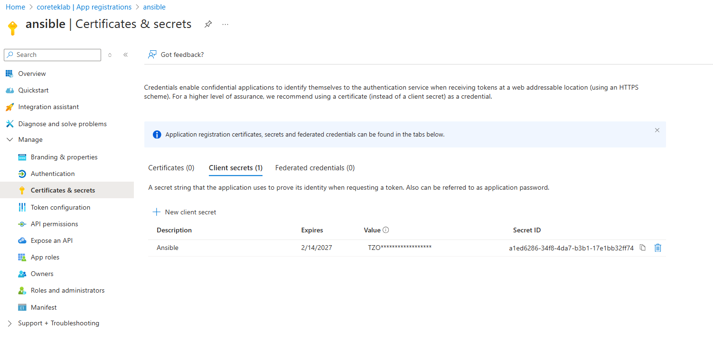
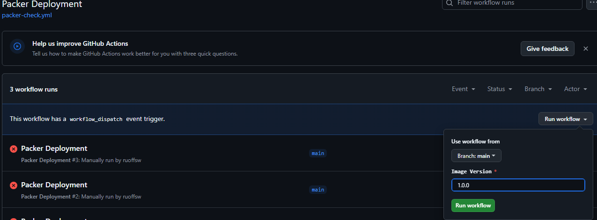

# Ansible_EUC

## Overview

This repository is used to create custom images in Azure using Packer and Ansible. The process involves creating a basic Azure VM with associated resources using a Packer Build Template. Ansible then connects to the VM and installs applications or makes configuration changes based on the playbook. This entire process is automated and triggered via GitHub Actions using GitHub's Ubuntu-Latest runner.

## Repository Structure

```
.
├── .github
│   ├── workflows
│   │   ├── packer-check-job.yml
│   │   └── packer-check.yml
├── avd
│   ├── packer
│   │   ├── ansible
│   │   │   ├── avd-win11.yml
│   │   │   ├── roles
│   │   │   │   └── AVD-Cleanup
│   │   └── build-templates
├── LICENSE
└── README.md
```

### Key Files and Folders

- **.github/workflows**: Contains GitHub Actions workflows that automate the build and deployment process.
  - `packer-check-job.yml`: Defines the job for deploying a Packer build.
  - `packer-check.yml`: Triggers the `packer-check-job.yml` workflow on pull requests and manual dispatch.

- **avd/packer/ansible**: Contains Ansible playbooks and roles for configuring the VM.
  - `avd-win11.yml`: The main Ansible playbook for configuring a Windows 11 VM.
  - `roles/AVD-Cleanup`: Contains tasks for cleaning up the VM after configuration.

- **LICENSE**: The MIT License file for the repository.

## Prerequisites

Before you can use this repository, you need to have the following:

- An Azure subscription with appropriate permissions to create resources.
- GitHub account with access to this repository.
- GitHub Secrets set up for the following:
  - `ARM_CLIENT_ID`
  - `ARM_CLIENT_SECRET`
  - `ARM_SUBSCRIPTION_ID`
  - `ARM_TENANT_ID`
  - `ANSIBLE_COLLECTION_PAT` (if using Ansible collections from a private repository)

## Setting Up GitHub Secrets

1. Go to the repository on GitHub.
2. Click on `Settings`.
3. Click on `Secrets and variables` > `Actions`.
4. Click on `New repository secret` and add the following secrets:
   - `ARM_CLIENT_ID`
   - `ARM_CLIENT_SECRET`
   - `ARM_SUBSCRIPTION_ID`
   - `ARM_TENANT_ID`
   - `ANSIBLE_COLLECTION_PAT` (if needed)

## GitHub Actions Workflows

### packer-check-job.yml

This workflow is responsible for deploying a Packer build job.

```yaml
name: 'Packer Deployment Job'

on:
  workflow_call:
    inputs:
      build-template:
        required: true
        type: string
      version:
        required: false
        type: string

env:
  packer_build_template: ${{ inputs.build-template }}
  version: ${{ inputs.version }}

jobs:
  hcp-packer:
    runs-on: ubuntu-Latest
    defaults:
      run:
        working-directory: avd/packer
    name: Packer Build
    steps:
      - name: Checkout
        uses: actions/checkout@v3

      - name: Setup `packer`
        uses: hashicorp/setup-packer@main
        id: setup
        with:
          version: "latest"

      - name: Run `packer init`
        id: init
        run: packer init build-templates/${{ env.packer_build_template }}

      - name: Run `packer validate`
        id: validate
        run: packer validate build-templates/${{ env.packer_build_template }}

      - name: Build Image
        run: |
          IMAGE_VERSION="${{ env.version }}"
          SKIP_CREATE_IMAGE="false"
          if [ "${{ github.event_name }}" = "pull_request" ]; then
            SKIP_CREATE_IMAGE="true"
          fi
          packer build -color=false -force \
            -var 'git_commit_sha=${{ github.sha }}' \
            -var 'github_source=${{ github.repository }}' \
            -var "skip_create_image=$SKIP_CREATE_IMAGE" \
            -var "image_version=$IMAGE_VERSION" \
            -var "client_id=${{ secrets.ARM_CLIENT_ID }}" \
            -var "client_secret=${{ secrets.ARM_CLIENT_SECRET }}" \
            -var "subscription_id=${{ secrets.ARM_SUBSCRIPTION_ID }}" \
            -var "tenant_id=${{ secrets.ARM_TENANT_ID }}" \
            build-templates/${{ env.packer_build_template }}
        env:
          ARM_CLIENT_ID: ${{ secrets.ARM_CLIENT_ID }}
          ARM_CLIENT_SECRET: ${{ secrets.ARM_CLIENT_SECRET }}
          ARM_SUBSCRIPTION_ID: ${{ secrets.ARM_SUBSCRIPTION_ID }}
          ARM_TENANT_ID: ${{ secrets.ARM_TENANT_ID }}
```

### packer-check.yml

This workflow triggers the `packer-check-job.yml` workflow on pull requests and manual dispatch.

```yaml
name: 'Packer Deployment'

on:
  pull_request:
    paths:
      - 'avd/packer/**'
  workflow_dispatch:
    inputs:
      version:
        description: 'Image Version'
        required: true
        type: string

permissions:
  id-token: write
  contents: read

jobs:
  Windows-11-STIG:
    uses: coretek/Ansible_EUC/.github/workflows/packer-check-job.yml@main
    with:
      build-template: avd-win11.pkr.hcl
      version: ${{ github.event.inputs.version }}
    secrets: inherit
```

## Ansible Playbooks and Roles

### avd-win11.yml

This is the main Ansible playbook used to configure a Windows 11 VM.

```yaml
---
- hosts: default
  roles:
    - avd-base
    - chocolatey
    - azure-cli
    - az-powershell
    - terraform
    - powershell-modules
    - vscode
    - git
    - kube
    - python
    - putty
    - dotnet
    - az-functions
    - teams
    - chrome
    - optimization
    - AVD-Cleanup
```

## How to Use

1. **Fork the Repository**: Fork this repository to your GitHub account.

2. **Clone the Repository**: Clone the repository to your local machine.

    ```bash
    git clone https://github.com/<your-username>/Ansible_EUC.git
    cd Ansible_EUC
    ```

3. **Set Up GitHub Secrets**: Follow the instructions in the "Setting Up GitHub Secrets" section to add the necessary secrets to your GitHub repository. 

    **Note**: We use an Azure Service Principal for authentication in Azure. You need to add the VALUE of the Client Secret of this Service Principal to the repository as the secret `ARM_CLIENT_SECRET`. 

5. **Trigger the Workflow**: You can trigger the workflow by creating a pull request or manually dispatching the workflow from the GitHub Actions tab. 

6. **Monitor the Workflow**: Monitor the workflow runs in the GitHub Actions tab to see the progress and check for any errors.

7. **Check the Output**: Once the workflow completes, check the output in the Azure portal to see the created VM and associated resources.

## License

This repository is licensed under the MIT License. See the [LICENSE](LICENSE) file for more information.

## Contributing

Contributions are welcome! Please open an issue or submit a pull request for any improvements or bug fixes.

## Contact

For any questions or support, please open an issue in this repository.
